<div align="center">

# SETU

### Give any 5G core the services it doesn't have.

**Release 1: IMS.** Voice, video and SMS on your 5G standalone core, from day zero.

[](LICENSE)
[](go.mod)
[](go.mod)
[](#release-1--ims)
[](#what-weve-actually-verified)

<br>


</div>

---

Your 5G standalone core routes data beautifully. Then someone asks for a phone call.

Voice on 5G means VoNR. VoNR means IMS. And connecting a 5G core to an IMS means building a
translator between two protocol worlds that were never designed to meet: Diameter on one side,
HTTP/2 service-based interfaces on the other, with a pile of vendor-specific behaviour in between.
Everyone who needs voice builds that translator by hand, against one core, once. Then they build it
again for the next deployment.

**SETU is that translator, built properly and given away.** Put it between your core and an IMS,
point it at both, and you get voice, video and messaging. Your IMS doesn't change. Your core doesn't
learn a proprietary interface.

*Setu* (सेतु) means *bridge*.

## What it looks like when it works

Two handsets registering, a video call, and an SMS:

<div align="center">
  
</div>

<details>
<summary>The same output as text</summary>

```
10:14:22  🔐 REGISTER imsi 001010000000001  UAR ✓ S-CSCF assigned
10:14:22  🔑 AUTH     imsi 001010000000001  MAR ✓ AKA vector issued (AKAv1-MD5)
10:14:23  📇 REGISTER imsi 001010000000001  SAR ✓ profile+iFC stored  · msisdn 1001001488
10:14:31  🔐 REGISTER imsi 001010000000002  UAR ✓ S-CSCF assigned
10:14:31  🔑 AUTH     imsi 001010000000002  MAR ✓ AKA vector issued (AKAv1-MD5)
10:14:32  📇 REGISTER imsi 001010000000002  SAR ✓ profile+iFC stored  · msisdn 1001001489

10:16:04  🎧 AUDIO    ue 198.51.100.88   5QI-1 GBR voice  ✓ bearer UP  · sess imsi-…001-24
10:16:04  🎥 VIDEO    ue 198.51.100.88   5QI-2 GBR video  ✓ bearer UP  · sess imsi-…001-24
10:16:05  🧭 LOCATE   LIR ✓ terminating S-CSCF returned
10:16:06  🎧 AUDIO    ue 198.51.100.89   5QI-1 GBR voice  ✓ bearer UP  · sess imsi-…002-27
10:16:06  🎥 VIDEO    ue 198.51.100.89   5QI-2 GBR video  ✓ bearer UP  · sess imsi-…002-27
10:17:48  📴 CALL-END sess imsi-…001-24   dedicated bearer released
10:17:48  📴 CALL-END sess imsi-…002-27   dedicated bearer released

10:19:11  💬 SMS      1001001489 → 1001001488  "on my way 🤗"  ✓ delivered
10:19:11  ✅ SMS-ACK  to 1001001489  submit-report sent  · ref 30
```

</details>

One line per event, no protocol dumps. When something breaks you see it immediately, which matters
more than it sounds at three in the morning.

## Contents

- [The gap SETU fills](#the-gap-setu-fills)
- [What SETU is, and what it isn't](#what-setu-is-and-what-it-isnt)
- [How it works](#how-it-works)
- [A call, end to end](#a-call-end-to-end)
- [Release 1 — IMS](#release-1--ims)
- [Quickstart](#quickstart)
- [Configuration](#configuration)
- [Deployment](#deployment)
- [Extending SETU](#extending-setu)
- [Things we learned the hard way](#things-we-learned-the-hard-way)
- [Roadmap](#roadmap)
- [FAQ](#faq)
- [Contributing](#contributing)
- [License](#license)

## The gap SETU fills

A 5G core and an IMS say the same things in different languages.

| | 5G core | IMS |
|---|---|---|
| Transport | HTTP/2, JSON | Diameter, SIP |
| Policy and media | `Npcf_PolicyAuthorization` (N5) | `Rx` (TS 29.214) |
| Subscriber and auth | `Nudr`, `Nausf` | `Cx` (TS 29.228/29.229) |
| Messaging | not addressed | SMS over IP (TS 24.011/23.040) |

Neither specification bridges the two, so every deployment writes its own translator. They all rot
the same way. The core's quirks get compiled into the translation logic, so switching cores means a
fork. Session state lives in memory, so a restart strands live sessions inside the core. Failures get
swallowed, because the caller has no vocabulary for them, and the operator sees mystery call
failures instead of a cause.

The result is expensive to build, impossible to reuse, and fragile in the one place a network can't
afford fragility.

We got tired of that. SETU is the version that gets built once, in the open, and stays built.

## What SETU is, and what it isn't

**It is** a signalling bridge that sits between your core and an external system, speaks both
protocol worlds fluently, and takes ownership of the awkward parts: session state, failure
semantics, and per-vendor behaviour.

**It isn't** an IMS, and it isn't a 5G core. It won't replace Kamailio and it won't replace your PCF.
Bring your own of each; SETU makes them work together.

In practice:

* **Your IMS doesn't change.** Release 1 ran against a stock Kamailio. The only edit was pointing its
  `Rx` and `Cx` peers at SETU.
* **No HSS required.** Subscriber data and authentication vectors come from the 5G core itself.
* **No proprietary interfaces.** What SETU asks of a core is exactly what 3GPP already specifies for
  IMS support. See [what your core needs to provide](#what-your-core-needs-to-provide).

## How it works

External systems attach through **adapters**. 5G cores attach through **connectors**. A small shared
model sits between them, and neither side ever sees the other's dialect.

```
   ┌──────────────────────┐      ┌──────────────────────────┐      ┌──────────────────────┐
   │      5G SA CORE      │      │           SETU           │      │  EXTERNAL SYSTEMS    │
   │                      │      │                          │      │                      │
   │   PCF   UDR   UDM    │◄────►│  connectors ⇄ adapters   │◄────►│  IMS   ← Release 1   │
   │   AMF   SMF   UPF    │ SBI  │                          │ Rx   │  P/I/S-CSCF          │
   │                      │HTTP/2│      canonical model     │ Cx   │  VoNR · ViNR · SMS   │
   │  ▸ SD-Core  (today)  │      │      session fabric      │ SIP  │                      │
   │  ▸ free5GC, Open5GS, │      │      dialects            │      │  ▸ more systems and  │
   │    your core  →      │      │                          │      │    interfaces  →     │
   └──────────────────────┘      └──────────────────────────┘      └──────────────────────┘
        write a connector                                              write an adapter
```

Twenty-two packages, and the dependency rule is one sentence: **the middle imports neither edge.**

<div align="center">
  
</div>

Every cell carries its real line count. The largest is `sdcore/rx2n5` at 535 lines — the Rx-to-N5
translation, which is exactly where the difficulty of this problem lives. The centre is the smallest
thing on the page, which is the point: a narrow waist only works if it is narrow.

Three decisions carry most of the weight.

**Capability negotiation.** A connector declares what its core can actually do: in-place policy
update, reading sessions back, whether it issues authentication vectors itself. SETU adapts to the
answer instead of assuming. A core missing a feature degrades along a path we chose, rather than
failing somewhere confusing.

**Dialects.** Bandwidth defaults, omitted fields, awkward URL shapes: all of it lives in a JSON file
as data. Supporting a core's quirks should never mean forking a translator, and here it doesn't.

**A session fabric that survives.** Every authorized session is journaled to a write-ahead log.
Restart SETU mid-call and it picks up its own state instead of leaving orphaned policy rules
accumulating inside your PCF.

### What your core needs to provide

SETU is a bridge, not a substitute for missing core functionality. Voice leans on parts of the
specifications that data-only deployments never touch, and open cores implement them to varying
degrees. Yours will need:

| Capability | Specification | Why it matters |
|---|---|---|
| Media authorization over **N5** | TS 29.514 | SETU asks the PCF to authorize the call's media |
| **Dedicated QoS flows** from policy rules | TS 23.502, TS 24.501 | The PCF's decision has to become a real GBR bearer through PDU session modification |
| **P-CSCF discovery** in the PDU session | TS 24.501 (PCO) | The handset can't register until it learns where the IMS is |
| Subscriber data over **Nudr** | TS 29.505 | Authentication material and identities for `Cx` |
| **IMS voice indication** at registration | TS 24.501 | Handsets only attempt VoNR when the network advertises support |

Gaps here look like calls that complete in signalling but never get a bearer. When you hit one, fix
it in the core: that's where the specification puts it, and every service on that core benefits, not
just this bridge. SETU deliberately doesn't paper over these. Hiding the problem would trade a day of
debugging now for a permanent workaround later.

## A call, end to end

What happens when a subscriber presses dial. SETU is the middle column.

```
 UE            Kamailio IMS           SETU                  5G Core
  │                  │                  │                      │
  │─ INVITE ────────►│                  │                      │
  │                  │─ Rx AAR ────────►│                      │
  │                  │                  │─ N5 app-session ────►│  PCF authorizes media
  │                  │                  │◄──────── 201 ────────│  PCF → SMF → dedicated
  │                  │◄──── 2001 ───────│                      │  5QI-1 GBR bearer to the UE
  │◄─ 183 / 200 OK ──│                  │                      │
  │◄══════════════ voice over the guaranteed bearer ═══════════│
  │                  │                  │                      │
  │─ BYE ───────────►│─ Rx STR ────────►│─ delete ────────────►│  bearer released
```

That is the shape. Here it is for real — every message across the deployment we run, including
registration, video and SMS:

<div align="center">
  
</div>

Three lifelines carry a ◆. Those are the network functions we had to change to make IMS possible at
all — twenty-three files across the AMF, SMF and PCF. Every change stayed inside the NF's own module,
with `go.mod` byte-identical to the upstream tag, so moving to a newer release is a rebase rather than
a re-derivation. Nothing on the IMS side carries a marker, because nothing there needed one.

Registration works the same way. The S-CSCF asks over `Cx`, SETU pulls the subscriber's key material
from the core's `Nudr`, computes the IMS-AKA vector, and answers. The handset gets challenged and
authenticated with no HSS anywhere in the picture.

## Release 1 — IMS

| Adapter | Specification | What you get |
|---|---|---|
| **Rx** | TS 29.214 | Dedicated GBR bearers for media: 5QI-1 voice, 5QI-2 video |
| **Cx** | TS 29.228 / 29.229 | Registration and IMS-AKA authentication (UAR, LIR, SAR, MAR) from core subscriber data |
| **SMS over IP** | TS 24.011 / 23.040 | Messaging both directions, GSM 7-bit and UCS-2 |

Shipping connector: OMEC / Aether **SD-Core**, with N5 policy authorization, dedicated QoS flow
establishment and P-CSCF discovery in place.

### What we've actually verified

Commercial handsets, a LiteON O-RU 5G SA radio, SD-Core, SETU, Kamailio P/I/S-CSCF. Real calls, not
a simulator.

| | |
|---|---|
| ✅ **Registration** | Full IMS-AKA cycle, UAR → MAR → 401 challenge → SAR → 200, accepted by the handset |
| ✅ **VoNR** | Dedicated 5QI-1 GBR bearer up per call, released on hangup |
| ✅ **ViNR** | 5QI-2 video bearer alongside voice |
| ✅ **SMS** | Both directions, GSM 7-bit and UCS-2, emoji included, with submit reports |
| ✅ **Teardown** | Clean release across repeated calls, no policy-rule accumulation |
| ✅ **Restart safety** | Killed mid-session, restarted, nothing stranded on the core |

### What's lab-grade

Please read this before putting it anywhere that matters.

* **Single instance.** No clustering, no failover.
* **TLS verification is off in the example config**, because lab certificates are self-signed. Don't
  ship that.
* **`strict` mode defaults to off.** Rx answers success even when the core rejects, matching the
  hand-built bridges SETU replaces. Turn it on for real TS 29.214 error codes.
* Measured around 75 media-authorization cycles per second on one node. Not capacity-tested past that.

### What isn't built yet

* **A second core connector.** The pluggable design is real and contracted, but until someone ships a
  connector for another core, treat portability as an architectural claim rather than a proven one.
  We'd rather say that than imply otherwise.
* Core-initiated teardown (`RAR` / `ASR` toward the IMS). Notifications arrive; they aren't
  translated back yet.
* In-place session update. A re-negotiation currently creates a new session instead of modifying one.
* Inter-operator interworking (SEPP / N32).

## Quickstart

Go 1.26+ or Docker. No dependencies, so it builds offline and will still build in five years.

```bash
git clone https://github.com/coranlabs/SETU.git
cd SETU
go test ./...
go build -o setu ./cmd/setu
```

Point it at your core and your IMS:

```bash
cp deploy/setu.example.json setu.json
# set sdcore.pcf, sdcore.udr, and the host and S-CSCF addresses
./setu -config setu.json -apps rx,cx,sms
```

Then aim your IMS at SETU. In Kamailio that means setting the `cdp` peers for `Rx` and `Cx` to
SETU's addresses. Nothing else on the IMS side changes.

SETU refuses to start when core endpoints are missing. That's deliberate. A stale built-in address
fails silently, and silent failures cost afternoons.

## Configuration

One JSON file.

```json
{
  "plmn": { "mcc": "001", "mnc": "01" },
  "core": "sdcore",
  "sdcore": {
    "pcf": "https://pcf.example.net:29507",
    "udr": "https://udr.example.net:29504",
    "notifURI": "http://setu.example.net:7777/notif",
    "notifListen": ":7777"
  },
  "rx":  { "listen": ":3868", "hostIP": "203.0.113.10", "walPath": "/var/lib/setu/rx-grants.wal" },
  "cx":  { "listen": ":3869", "hostIP": "203.0.113.10", "scscf": "sip:203.0.113.10:6060" },
  "sms": { "listen": "127.0.0.1:8090", "scscf": "203.0.113.10:6060", "selfIP": "203.0.113.10" }
}
```

| Key | Notes |
|---|---|
| `plmn` | The home domain is derived from it per TS 23.003, unless you set `domain` yourself |
| `core` | Selects the connector |
| `walPath` | Enables the write-ahead log. Empty means memory-only. Set it anywhere a restart must not strand sessions |
| `rx.strict` | `false` answers 2001 always; `true` returns real TS 29.214 error codes |
| `-apps` | All adapters in one process, or split them: `-apps rx`, `-apps cx,sms` |

Per-core behaviour lives in [`dialects/`](dialects/). Start with [`dialects/sdcore.json`](dialects/sdcore.json).

## Deployment

Docker, host networking, since the adapters bind well-known signalling ports and the SMS ingest has
to be reachable on host loopback:

```bash
docker build -f deploy/Dockerfile.build -t setu:1.0 .
docker run -d --name setu --network host --restart unless-stopped --stop-timeout 15 \
  -v /etc/setu/setu.json:/etc/setu/setu.json:ro \
  -v /var/lib/setu:/var/lib/setu \
  setu:1.0
```

`docker stop` sends `SIGTERM`, which drains session state before exit. Keep the write-ahead log on a
host volume so it survives container replacement.

For systemd, see [`deploy/setu.service`](deploy/setu.service). Prometheus metrics and health live on
the admin listener, `:9102` by default.

## Extending SETU

Two extension points, and they're deliberately symmetrical.

### Add a 5G core: write a connector

```go
type CoreConnector interface {
    Name() string
    Capabilities() Caps          // what this core actually supports
    Policy() PolicyBackend       // authorize, update, revoke media
    Subscriber() SubscriberBackend
    Auth() AuthBackend           // authentication vectors
    Events() EventSource         // core-initiated notifications
}
```

Declare capabilities honestly and the platform works around them:

```go
func (c *Connector) Capabilities() api.Caps {
    return api.Caps{
        PolicyUpdate: false,            // no in-place update: fall back to delete + create
        AuthVector:   api.AuthCoreUEAU, // this core issues vectors itself
    }
}
```

Start from [`connectors/sdcore/`](connectors/sdcore/), keep core-specific constants in a dialect
file, and test against a fake core with `httptest`. See
[`connectors/sdcore/connector_test.go`](connectors/sdcore/connector_test.go) for the pattern.

### Add an external system: write an adapter

An adapter terminates whatever protocol that system speaks and expresses it in the shared model. It
needs no knowledge of any core, and every existing connector works with it on day one.
[`adapters/rx/`](adapters/rx/) is the reference.

## Things we learned the hard way

Some of these cost us real days. They're in the code as fixes and in the tests as guards, and they're
here because anyone building in this space will meet the same class of problem.

**A guaranteed bit rate of zero is not a guaranteed bit rate.** Authorize a 5QI-1 flow without one
and the bearer comes up, but the handset never completes its QoS precondition and the call dies at
`580 Precondition Failure`. The SDP tells you the bandwidth. Use it, and default sensibly when it
doesn't.

**The PCF hands you a URL you can't dial.** Ours returned an app-session `Location` built from its
own service name, which the bridge host couldn't resolve. Deletes failed quietly, policy rules piled
up, and calls started failing after the first one on a subscriber. Now the path gets re-attached to
an address we know is reachable, and a 404 on delete counts as success.

**`fsync` does not belong on the answer path.** Journaling each session synchronously dropped
throughput to roughly one transaction per second. A single background writer keeps ordering and gets
the durability without stalling signalling.

**IMS-AKA and 5G-AKA share the same sequence number.** Issue a vector without advancing it and the
next authentication is rejected as a replay. Registration collapses in a way that looks convincingly
like a radio problem.

**Bytes from the network are hostile.** The SMS decoder panicked on a malformed submit. It's fully
bounds-checked now, with the malformed cases in the test suite, because a signalling element should
never die on input someone else controls.

## Roadmap

| Release | Focus |
|---|---|
| **1.0** | **IMS on SD-Core: Rx, Cx, SMS** *(this release)* |
| 1.1 | Core-initiated teardown (RAR/ASR), in-place session update, `strict` on by default |
| 1.2 | Second core connector, plus a conformance suite so connectors can prove themselves |
| 2.0 | Inter-operator interworking: SEPP / N32 |
| later | More external interfaces, and out-of-process connectors in any language |

The direction doesn't change: **one bridge, more things plugged into it.**

## FAQ

**Does SETU replace my IMS?**
No. It connects your 5G core to an IMS you already run. Release 1 was proven against Kamailio, and
anything speaking standard `Rx` and `Cx` should work.

**Do I need an HSS?**
No. SETU answers `Cx` from the 5G core's own subscriber data and generates IMS-AKA vectors from it.

**Will it work with my 5G core?**
If your core exposes standard SBI interfaces, it needs a connector, typically a few hundred lines.
SD-Core ships today. free5GC and Open5GS are on the roadmap. If you write one, please send it back.

**Do I have to modify my core or my IMS?**
Your IMS, no. Your core, only if it doesn't yet implement the standard IMS-facing behaviour listed
under [what your core needs to provide](#what-your-core-needs-to-provide). Voice exercises paths that
data-only deployments often leave incomplete.

**Is it production-ready?**
Not yet, and [we've listed exactly why](#whats-lab-grade). It's a working, verified foundation. We'd
rather you know the limits now than discover them during an outage.

**Why Go, and why no dependencies?**
Something sitting on the call path should be auditable end to end and buildable offline years from
now, without a supply chain attached to it.

## Contributing

Contributions are welcome, and connectors for other 5G cores most of all. That's what turns this from
a working bridge into a portable one.

[CONTRIBUTING.md](CONTRIBUTING.md) covers the workflow and the sign-off requirement.
[CODE_OF_CONDUCT.md](CODE_OF_CONDUCT.md) covers community expectations. Security issues go privately
through [SECURITY.md](SECURITY.md), not the issue tracker.

Built on the work of the open telecom community: the **Kamailio** project, whose CSCFs are the IMS
side of Release 1; **OMEC / Aether SD-Core**, the first core we connected; and **3GPP**, whose
specifications make an interoperable bridge possible at all.

## License

Copyright 2026 Coran Labs Private Limited.

Licensed under the Apache License, Version 2.0. See [LICENSE](LICENSE) and [NOTICE](NOTICE).

SETU interoperates with GPL-licensed software such as Kamailio over network protocols only. No
GPL-licensed code is included or linked.
